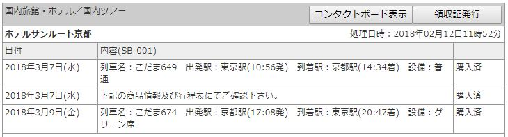
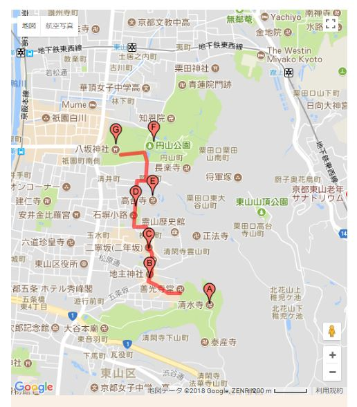
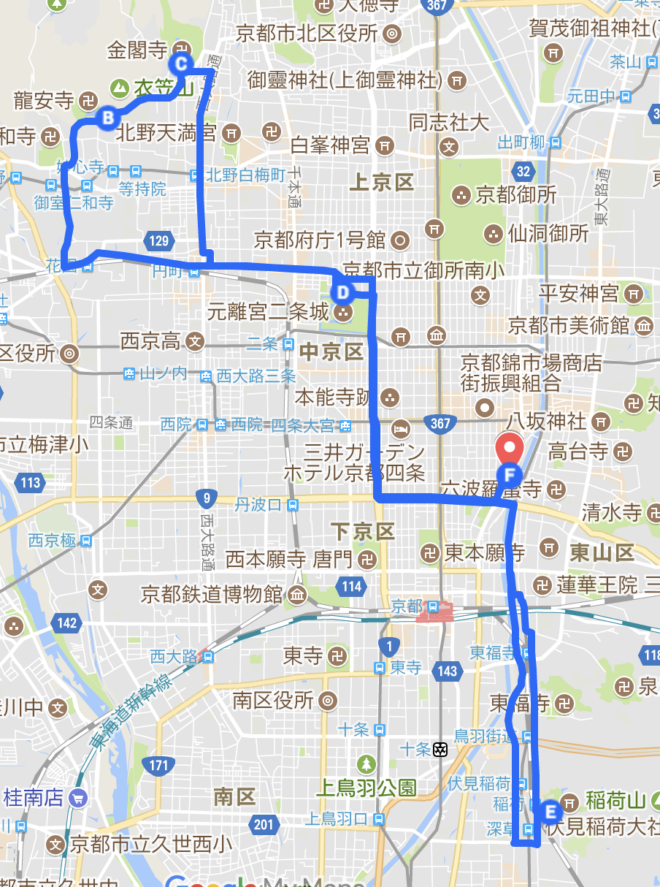
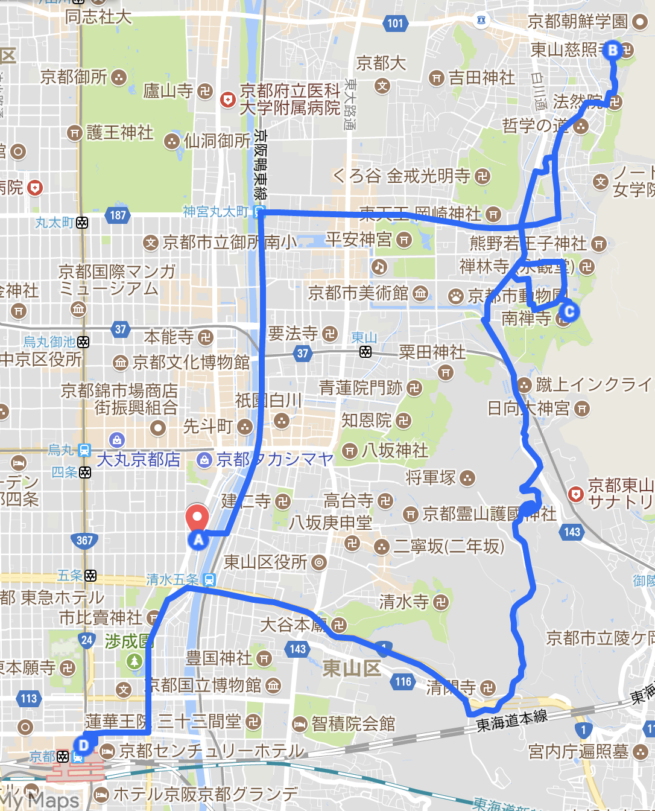

 

**1日目**
- 京都駅 
↓ 京都駅～五条駅【烏丸線】(約2分)
- [ホテルサンルート京都](http://www.hotel-sunroute-kyoto.co.jp/) 
↓ 【徒歩 約30分】
- 八坂神社 
↓ 円山公園～高台寺～ねねの道～二年坂～産寧坂【徒歩 約30分】
- [清水寺](http://www.kiyomizudera.or.jp/) 
↓【徒歩 約30分】
- ホテルサンルート京都 
 

 
 

**2日目**
- ホテルサンルート京都 
↓ 河原町松原～わら天神前【市バス】（約40分）
- [龍安寺](http://www.ryoanji.jp/smph/) 
↓ 竜安寺前～金閣寺前【市バス】（約10分）
- [金閣寺](http://www.shokoku-ji.jp/k_about.html) 
↓ 金閣寺前or金閣寺道【市バス】～二条城（約25分）
- [二条城](http://www2.city.kyoto.lg.jp/bunshi/nijojo/) 
↓ 二条城前駅～三条駅【東西線】、三条駅～伏見稲荷駅【京阪本線】（約35分）
- [伏見稲荷大社](http://inari.jp/) 
↓ 伏見稲荷駅～清水五条駅【京阪本線】（約20分）
- ホテルサンルート京都 
 

 

**3日目**
- ホテルサンルート京都 
↓ 河原町松原～銀閣寺道【市バス】（約30分）
- 銀閣寺 
↓ 哲学の道【徒歩 約30分】
- 南禅寺 
↓ 蹴上駅～京阪山科駅【東西線・京阪京津線】、山科駅～京都駅【東海道・山陽本線】（約30分）
- 京都駅

 
